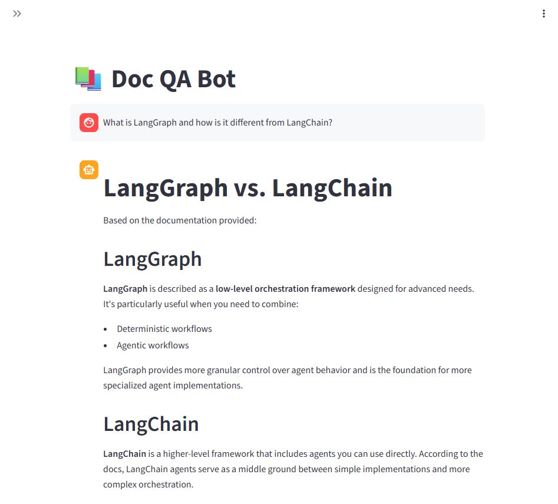
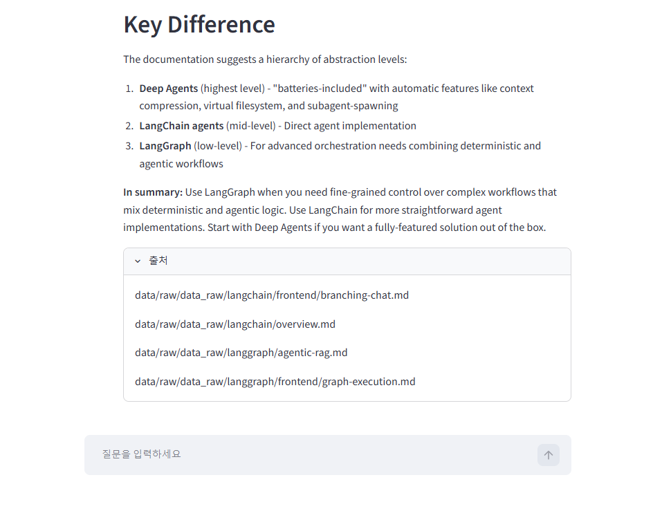
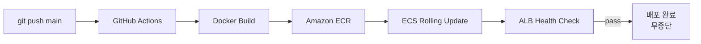

# Doc QA Bot

LangChain/LangGraph 공식 문서를 기반으로 질문에 답변하는 RAG(Retrieval-Augmented Generation) 챗봇입니다.
AWS에 무중단 배포되어 있으며 GitHub Actions를 통해 CI/CD 파이프라인이 자동화되어 있습니다.

## Demo




## Architecture




**무중단 배포**: `main` push → GitHub Actions → ECR 이미지 빌드 & 푸시 → ECS 롤링 업데이트 → ALB 헬스체크 통과 후 구 태스크 종료

## Tech Stack

| Category | Stack |
|---|---|
| Backend | FastAPI, LangChain |
| LLM | Claude API (claude-haiku-4-5) |
| Embedding | Ollama (nomic-embed-text) |
| Vector DB | ChromaDB |
| Frontend | Streamlit |
| Infrastructure | AWS ECS Fargate, EC2, EFS, ALB |
| CI/CD | GitHub Actions |
| Container Registry | Amazon ECR |

## How It Works

### 1. 문서 인제스트 파이프라인

```
data/raw/ (182개 파일)
    ↓
DirectoryLoader (md / txt / pdf)
    ↓
RecursiveCharacterTextSplitter (chunk_size=1000, overlap=200)
    ↓
MD5 해시로 중복 청크 제거
    ↓
nomic-embed-text (Ollama) → 768차원 벡터
    ↓
ChromaDB (EFS 영구 저장) — 3,854개 청크
```

`POST /ingest`를 호출하면 FastAPI `BackgroundTasks`로 비동기 처리됩니다. ALB 타임아웃 없이 즉시 202를 반환하고 백그라운드에서 인제스트를 수행합니다.

---

### 2. Hybrid Search (BM25 + Vector + RRF)

질문이 들어오면 두 방식으로 동시에 검색한 뒤 **Reciprocal Rank Fusion(RRF)** 으로 순위를 합산합니다.

```python
# 각 결과의 순위를 점수로 변환 (rrf_k=60)
score += 1 / (rank + 60)

# BM25 점수 + Vector 점수를 합산해 상위 4개 반환
```

- **BM25**: 키워드 일치 기반. 정확한 용어 검색에 강함
- **Vector**: 의미 유사도 기반. 표현이 달라도 관련 문서 검색 가능
- **RRF**: 두 결과를 단순 합집합이 아닌 순위 기반으로 재정렬

---

### 3. 멀티턴 RAG 체인 (LCEL)

```
[질문 + 대화 히스토리]
    ↓
CONTEXTUALIZE_PROMPT
→ 히스토리가 있을 때만 질문을 독립적으로 재구성
   예) "그게 뭐야?" → "LangGraph의 StateGraph가 무엇인가?"
    ↓
HybridRetriever → 관련 청크 4개
    ↓
RAG_PROMPT (컨텍스트 + 질문 + 히스토리)
    ↓
Claude API (claude-haiku-4-5)
    ↓
SSE 스트리밍으로 토큰 단위 실시간 반환
```

체인은 LangChain LCEL(`|` 파이프라인)로 구성되어 있으며, `astream()`으로 비동기 스트리밍을 지원합니다.

---

### 4. 자동 인제스트 & 캐시 무효화

APScheduler로 매일 새벽 3시에 자동 인제스트가 실행됩니다. 인제스트 완료 후 LRU 캐시를 초기화해 BM25 인덱스를 재구성합니다.

> BM25는 메모리 내 인덱스이므로 새 문서가 추가되면 `QueryService`를 재생성해야 반영됩니다.
> `lru_cache`를 제거해 다음 요청 시 자동으로 새 인덱스를 빌드하도록 구현했습니다.

---

## API Endpoints

| Method | Path | Description |
|---|---|---|
| `GET` | `/health` | 헬스체크 |
| `POST` | `/query` | 질문 답변 (단일 응답) |
| `POST` | `/query/stream` | 질문 답변 (SSE 스트리밍) |
| `POST` | `/ingest` | 문서 인제스트 (202 즉시 반환, 백그라운드 처리) |

**POST /query/stream** SSE 이벤트 형식:
```
data: {"type": "sources", "data": ["path/to/doc.md", ...]}
data: {"type": "token",   "data": "LangGraph는 "}
data: {"type": "token",   "data": "저수준 오케스트레이션..."}
data: {"type": "done",    "session_id": "abc123"}
```

---

## Features

- **RAG Pipeline**: 문서 로딩 → 청킹 → 벡터 임베딩 → Hybrid Search → LLM 답변
- **Hybrid Search**: BM25(키워드) + 벡터 검색 결합으로 검색 품질 향상
- **Streaming**: SSE(Server-Sent Events)로 답변을 실시간 스트리밍
- **Multi-turn**: 대화 히스토리 기반 멀티턴 질의응답
- **Source Citation**: 답변 근거 문서 출처 표시
- **Zero-downtime Deploy**: ECS 롤링 업데이트로 서비스 중단 없는 배포

## AWS Infrastructure

| Resource | Name | Description |
|---|---|---|
| VPC | `doc-qa-vpc` | 서울 리전, 퍼블릭/프라이빗 서브넷 |
| Security Groups | `sg-alb`, `sg-api`, `sg-ollama` | 체인 방식 접근 제어 |
| EC2 | `doc-qa-ollama` | t3.micro, Ollama 임베딩 서버 |
| ECS Cluster | `doc-qa-cluster` | Fargate |
| ECS Task | `doc-qa-task` | FastAPI + Streamlit 컨테이너 |
| ECR | `doc-qa-api`, `doc-qa-streamlit` | Docker 이미지 레지스트리 |
| EFS | `doc-qa-chroma` | ChromaDB 영구 저장소 |
| ALB | `doc-qa-alb` | HTTP:80 (API), HTTP:8501 (UI) |

## Project Structure

```
doc-qa-bot/
├── app/
│   ├── main.py
│   ├── api/
│   │   ├── deps.py          # 의존성 주입
│   │   ├── schemas.py
│   │   └── routers/
│   │       ├── health.py    # GET /health
│   │       ├── query.py     # POST /query, POST /query/stream
│   │       └── ingest.py    # POST /ingest
│   ├── domain/
│   │   ├── ingestion/       # loader, splitter
│   │   ├── llm/             # RAG chain, Claude client
│   │   └── retrieval/       # Hybrid retriever (BM25 + vector)
│   ├── infrastructure/      # ChromaDB, embedder
│   └── service/             # QueryService, IngestService, Scheduler
├── config/settings.py
├── docker/
│   ├── Dockerfile
│   └── Dockerfile.streamlit
├── .github/workflows/
│   └── deploy.yml           # GitHub Actions CI/CD
├── streamlit_app.py
└── docs/
    └── deployment.md        # 전체 AWS 배포 가이드
```

## Local Setup

```bash
# 1. 의존성 설치
pip install -r requirements.txt

# 2. 환경변수 설정 (.env)
ANTHROPIC_API_KEY=your_key
OLLAMA_BASE_URL=http://localhost:11434
EMBEDDING_MODEL=nomic-embed-text

# 3. Ollama 실행 및 임베딩 모델 pull
ollama pull nomic-embed-text

# 4. 문서 수집 (LangChain/LangGraph 공식 문서 스크래핑)
python scripts/scrape_docs.py
# → data/raw/langchain/, data/raw/langgraph/ 에 마크다운 파일 저장

# 5. FastAPI 서버 실행
uvicorn app.main:app --reload

# 6. 문서 인제스트
curl -X POST http://localhost:8000/ingest \
  -H "Content-Type: application/json" \
  -d '{"source_dir": "data/raw"}'

# 7. Streamlit UI 실행
streamlit run streamlit_app.py
```

## Environment Variables

| 변수 | 기본값 | 설명 |
|---|---|---|
| `ANTHROPIC_API_KEY` | — | Claude API 키 |
| `OLLAMA_BASE_URL` | `http://localhost:11434` | Ollama 서버 주소 |
| `EMBEDDING_MODEL` | `nomic-embed-text` | 임베딩 모델 |
| `LLM_MODEL` | `claude-haiku-4-5-20251001` | LLM 모델 |
| `LLM_TEMPERATURE` | `0.0` | 생성 온도 |
| `CHROMA_PERSIST_DIR` | `data/processed/chroma` | ChromaDB 저장 경로 |
| `DATA_RAW_DIR` | `data/raw` | 원본 문서 경로 |
| `CHUNK_SIZE` | `1000` | 청크 크기 |
| `CHUNK_OVERLAP` | `200` | 청크 오버랩 |
| `RETRIEVER_K` | `4` | 검색 청크 수 |
| `INGEST_SCHEDULE_HOUR` | `3` | 자동 인제스트 시각 (매일) |

## Deployment

전체 AWS 배포 가이드: [docs/deployment.md](docs/deployment.md)

`main` 브랜치에 push하면 GitHub Actions가 자동으로 ECR 빌드 & ECS 배포를 수행합니다.

```bash
git push origin main
```
