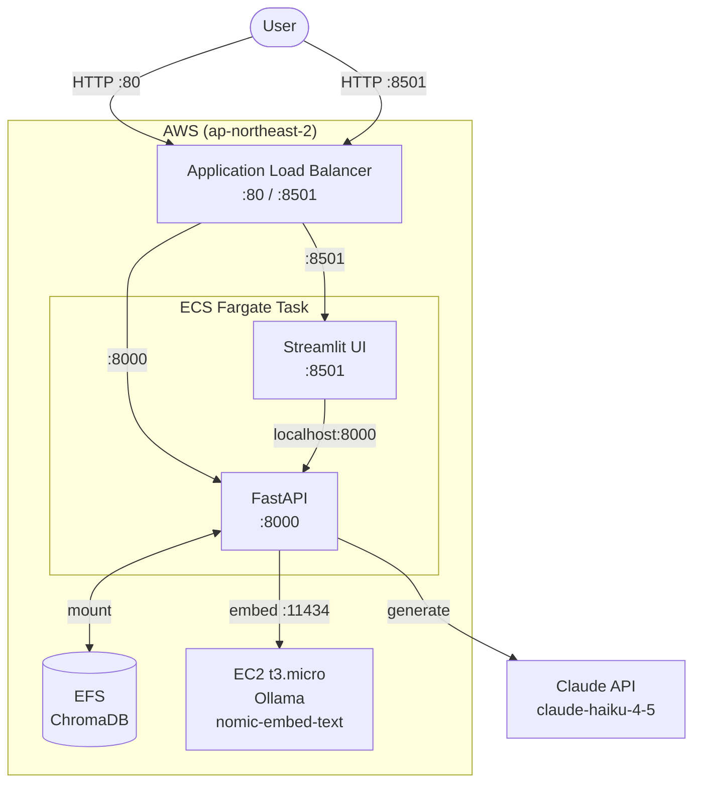
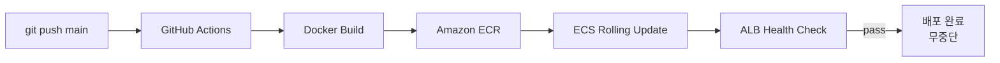

# Doc QA Bot

LangChain/LangGraph 공식 문서를 기반으로 질문에 답변하는 RAG(Retrieval-Augmented Generation) 챗봇입니다.
AWS에 무중단 배포되어 있으며 GitHub Actions를 통해 CI/CD 파이프라인이 자동화되어 있습니다.

## Demo


## Architecture





**무중단 배포**: `main` push → GitHub Actions → ECR 이미지 빌드 & 푸시 → ECS 롤링 업데이트 → ALB 헬스체크 통과 후 구 태스크 종료

## Tech Stack

| Category | Stack |
|---|---|
| Backend | FastAPI, LangChain |
| LLM | Claude API (claude-haiku-4-5) |
| Embedding | Ollama (nomic-embed-text) |
| Vector DB | ChromaDB |
| Frontend | Streamlit |
| Infrastructure | AWS ECS Fargate, EC2, EFS, ALB |
| CI/CD | GitHub Actions |
| Container Registry | Amazon ECR |

## Features

- **RAG Pipeline**: 문서 로딩 → 청킹 → 벡터 임베딩 → Hybrid Search → LLM 답변
- **Hybrid Search**: BM25(키워드) + 벡터 검색 결합으로 검색 품질 향상
- **Streaming**: SSE(Server-Sent Events)로 답변을 실시간 스트리밍
- **Multi-turn**: 대화 히스토리 기반 멀티턴 질의응답
- **Source Citation**: 답변 근거 문서 출처 표시
- **Zero-downtime Deploy**: ECS 롤링 업데이트로 서비스 중단 없는 배포

## AWS Infrastructure

| Resource | Name | Description |
|---|---|---|
| VPC | `doc-qa-vpc` | 서울 리전, 퍼블릭/프라이빗 서브넷 |
| Security Groups | `sg-alb`, `sg-api`, `sg-ollama` | 체인 방식 접근 제어 |
| EC2 | `doc-qa-ollama` | t3.micro, Ollama 임베딩 서버 |
| ECS Cluster | `doc-qa-cluster` | Fargate |
| ECS Task | `doc-qa-task` | FastAPI + Streamlit 컨테이너 |
| ECR | `doc-qa-api`, `doc-qa-streamlit` | Docker 이미지 레지스트리 |
| EFS | `doc-qa-chroma` | ChromaDB 영구 저장소 |
| ALB | `doc-qa-alb` | HTTP:80 (API), HTTP:8501 (UI) |

## Project Structure

```
doc-qa-bot/
├── app/
│   ├── main.py
│   ├── api/
│   │   ├── deps.py          # 의존성 주입
│   │   ├── schemas.py
│   │   └── routers/
│   │       ├── health.py    # GET /health
│   │       ├── query.py     # POST /query, POST /query/stream
│   │       └── ingest.py    # POST /ingest
│   ├── domain/
│   │   ├── ingestion/       # loader, splitter
│   │   ├── llm/             # RAG chain, Claude client
│   │   └── retrieval/       # Hybrid retriever (BM25 + vector)
│   ├── infrastructure/      # ChromaDB, embedder
│   └── service/             # QueryService, IngestService, Scheduler
├── config/settings.py
├── docker/
│   ├── Dockerfile
│   └── Dockerfile.streamlit
├── .github/workflows/
│   └── deploy.yml           # GitHub Actions CI/CD
├── streamlit_app.py
└── docs/
    └── deployment.md        # 전체 AWS 배포 가이드
```

## Local Setup

```bash
# 1. 의존성 설치
pip install -r requirements.txt

# 2. 환경변수 설정 (.env)
ANTHROPIC_API_KEY=your_key
OLLAMA_BASE_URL=http://localhost:11434
EMBEDDING_MODEL=nomic-embed-text

# 3. Ollama 실행 및 임베딩 모델 pull
ollama pull nomic-embed-text

# 4. FastAPI 서버 실행
uvicorn app.main:app --reload

# 5. 문서 인제스트
curl -X POST http://localhost:8000/ingest \
  -H "Content-Type: application/json" \
  -d '{"source_dir": "data/raw"}'

# 6. Streamlit UI 실행
streamlit run streamlit_app.py
```

## Deployment

전체 AWS 배포 가이드: [docs/deployment.md](docs/deployment.md)

`main` 브랜치에 push하면 GitHub Actions가 자동으로 ECR 빌드 & ECS 배포를 수행합니다.

```bash
git push origin main
```
